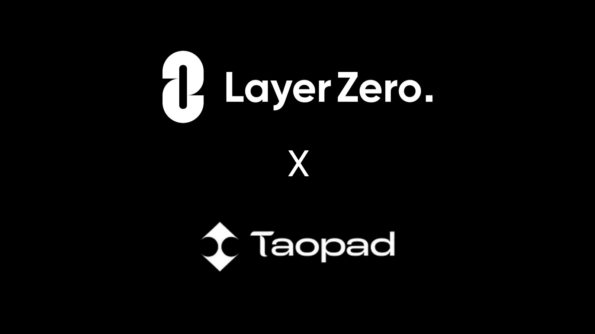

<div align="center">
    
</div>

---

# Bridge contracts for WTAO using Layer0 Protocol

### Install & Run tests

```shell
npm install
export PRIVATE_KEY=0x...123 # deployer private key
export ETHERSCAN_API_KEY=XYZ # Etherscan APY Key to verify contracts
export RPC_URL=https://alchemy.io/.../ # RPC Url for Ethereum Mainnet

npx hardhat test
```

### Deploying Proxy OFT on Mainnet

```shell
npm install
export PRIVATE_KEY=0x...123 # deployer private key
export ETHERSCAN_API_KEY=XYZ # Etherscan APY Key to verify contracts
export RPC_URL=https://alchemy.io/.../ # RPC Url for Ethereum Mainnet

npx hardhat --network mainnet deploy --tags oft-proxy --write true
```

### TBD
- Arbitrum OFTv2 Implementation
- Avalanche OFTv2 Implementation